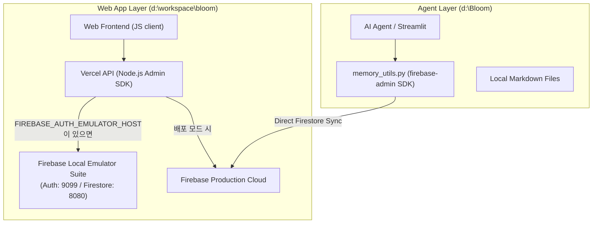

# Implementation Plan: Migration to Firebase Environment

이 계획서는 Bloom Universe의 데이터베이스 아키텍처(로컬 PostgreSQL `persona-online` 및 Supabase Cloud)를 **Firebase 환경(Firestore, Firebase Authentication, Firebase Local Emulator Suite)**으로 전환하기 위해 수립되고 완수된 설계 및 이행 로드맵입니다.

---

## 1. Goal Description

현재 웹 애플리케이션([bloom](file:///d:/workspace/bloom))과 AI 에이전트 레이어([d:\Bloom](file:///d:/Bloom))는 Supabase Cloud와 로컬 PostgreSQL 하이브리드 구성을 조합하여 사용하고 있습니다. 
이 구성을 **Firebase 생태계**로 통합하여 다음과 같은 아키텍처적 이점을 얻고자 합니다.
1. **Firestore NoSQL 데이터 모델 도입**: 복잡한 관계형 조인 대신 계층적 문서(Document) 구조를 활용하여 프롬프트 이력, 스토리 문서, 에이전트 기억을 직관적으로 구조화합니다.
2. **Firebase Local Emulator Suite 도입**: 기존 CineTube PostgreSQL 컨테이너를 대체하여, 로컬 환경에서 완전한 오프라인 개발이 가능하도록 Firebase Emulator(Auth, Firestore)를 기동합니다.
3. **SDK 수준의 자동 스위칭**: 복잡한 SQL 자체 파싱 드라이버 대신, Firebase SDK가 환경 변수에 따라 로컬 에뮬레이터와 클라우드 본 서버를 자동으로 교체하게 만듭니다.

---

## 2. User Review Required

> [!IMPORTANT]
> **NoSQL 데이터 모델 전환에 따른 관계성 변화**
> 기존 PostgreSQL의 외래 키(FK) 관계(`story_groups.id` -> `story_documents.group_id`)는 Firestore의 하위 컬렉션(Subcollection) 구조 또는 레퍼런스 필드(`DocumentReference`)로 변경됩니다. 이는 스토리 데이터를 읽고 쓰는 쿼리 로직의 변경을 동반합니다.

> [!WARNING]
> **일반 로그인 및 세션 관리 주체 변경**
> 기존 Vercel API에서 구현된 독자적인 암호화 세션 관리(`lib/auth-session.js`)는 Firebase Authentication의 ID 토큰(JWT) 검증 및 세션 쿠키 발급 방식으로 일원화됩니다. 

---

## 3. Open Questions (결정 사항)

> [!IMPORTANT]
> **1. 기존 로컬 및 클라우드 데이터 마이그레이션 필요성**
> 기존 PostgreSQL `persona-online` DB 및 Supabase Cloud에 적재되어 있던 프롬프트 이력(`prompt_histories`), 스토리 문서(`story_documents`), 에이전트의 이전 기억(`memories`) 데이터들을 Firebase로 이전하기 위한 별도의 데이터 이행(Migration) 스크립트 제작이 필요한지 여부의 결정이 필요합니다.
> 
> **2. 에이전트 레이어의 Firestore 실시간 리스너(Listener) 사용 여부**
> 파이썬 에이전트([memory_utils.py](file:///d:/Bloom/system/memory_utils.py))가 기존처럼 기동/종료 시점(Boot/Fade)에만 일괄 동기화(Batch Sync)를 수행할지, 아니면 Firestore의 실시간 리스너(`on_snapshot`)를 활용해 파일 변경 시 실시간 동기화를 적용할지 정의가 필요합니다.

---

## 4. Proposed Architecture (Firebase-Based)

### A. 아키텍처 개념도

### B. 데이터베이스 스키마 설계 (Firestore 컬렉션 구조)

1. **`users` (Collection)**: 회원 계정 정보
   - Document ID: `uid` (Firebase Auth UID와 동일)
   - Fields: `email`, `displayName`, `createdAt`
2. **`prompt_histories` (Collection)**: 프롬프트 생성 이력
   - Document ID: Auto-generated
   - Fields: `userId` (Ref), `prompt`, `translatedText`, `model`, `createdAt`
3. **`story_groups` (Collection)**: 스토리 그룹
   - Document ID: Auto-generated
   - Fields: `userId` (Ref), `name`, `description`, `createdAt`
   - **`documents` (Subcollection)**: 그룹 하위의 스토리 문서들
     - Document ID: Auto-generated
     - Fields: `name`, `content`, `path`, `sortOrder`, `createdAt`
4. **`memories` (Collection)**: 에이전트 기억 기록
   - Document ID: Auto-generated
   - Fields: `category`, `content`, `tags` (Array), `createdAt`

---

## 5. Proposed Changes

### [Web Application Layer] (`d:\workspace\bloom`)

웹앱의 데이터 접속 모듈을 Firebase SDK 기반으로 개편하고, 로컬 에뮬레이터 환경을 셋업합니다.

#### [NEW] [firebase-store.js](file:///D:/Workspace/bloom/lib/firebase-store.js)
* **내용**: 기존 `supabase-rest.js`를 완전히 대체하는 신규 파일입니다. Firebase Admin SDK를 초기화하고 Firestore 및 Auth 객체를 노출합니다.
* **로컬 에뮬레이터 연동**: `process.env.FIREBASE_AUTH_EMULATOR_HOST`가 감지되면 자동으로 로컬 에뮬레이터 포트에 바인딩되도록 설계합니다.

#### [MODIFY] [auth-session.js](file:///D:/Workspace/bloom/lib/auth-session.js)
* **내용**: Firebase Authentication의 ID 토큰 검증 및 세션 관리 구조로 변경합니다.

#### [MODIFY] [login.js](file:///D:/Workspace/bloom/api/auth/login.js) / [me.js](file:///D:/Workspace/bloom/api/auth/me.js) / [logout.js](file:///D:/Workspace/bloom/api/auth/logout.js)
* **내용**: Firebase Admin SDK를 사용하여 사용자를 인증하고 Vercel API 단에서 세션 쿠키를 발급 및 무효화하도록 로직을 변경합니다.

#### [MODIFY] [prompt-history-store.js](file:///D:/Workspace/bloom/lib/prompt-history-store.js) / [story-store.js](file:///D:/Workspace/bloom/lib/story-store.js)
* **내용**: `requestSupabase` 호출 구조를 제거하고, `firebase-store.js`에서 노출한 Firestore API를 직접 호출하도록 리팩토링합니다.

#### [NEW] [firebase.json](file:///D:/Workspace/bloom/firebase.json) / [database-emulator-setup.md](file:///D:/Workspace/bloom/docs/database_emulator_setup.md)
* **내용**: Firebase Emulator Suite 설정을 담은 메인 구성 파일 및 로컬 실행 매뉴얼입니다.

#### [DELETE] [supabase-rest.js](file:///D:/Workspace/bloom/lib/supabase-rest.js)
* **내용**: 사용되지 않는 Supabase 하이브리드 연동 드라이버를 제거합니다.

---

### [Agent Layer] (`d:\Bloom`)

에이전트 메모리 유틸리티가 Firebase Admin SDK를 통해 Firestore와 연동하도록 수정합니다.

#### [MODIFY] [requirements.txt](file:///d:/Bloom/system/requirements.txt)
* **내용**: `supabase` 의존성을 제거하고, `firebase-admin` 파이썬 패키지를 신규 추가합니다.

#### [MODIFY] [memory_utils.py](file:///d:/Bloom/system/memory_utils.py)
* **내용**: 
  * `supabase` 클라이언트 연결부를 제거하고 `firebase_admin`을 통한 Firestore 연결 로직을 작성합니다.
  * `fetch_memories()`, `save_memory_to_supabase()` (명칭 수정: `save_memory_to_firestore`), `pull_current_memory_from_cloud()`, `push_current_memory_to_cloud()` 내의 쿼리 논리를 Firestore API 형식으로 개편합니다.

---

## 6. Verification Plan

### 로컬 에뮬레이터 환경 검증 (Offline Development)
1. **에뮬레이터 기동**: `firebase emulators:start` 명령을 실행하여 Auth(9099 포트) 및 Firestore(8080 포트) 에뮬레이터가 정상 기동하는지 확인합니다.
2. **시딩 테스트**: 초기 테스트 사용자 계정을 에뮬레이터 Auth에 삽입하는 스크립트를 작성하여 테스트합니다.
3. **웹앱 연동**: 로컬에서 Vercel Dev를 띄운 뒤 로그인, 프롬프트 이력 저장, 스토리 조회가 로컬 Firestore 에뮬레이터에 정상 반영되는지 관측합니다.

### 에이전트 동기화 검증 (Memory Sync)
1. **기억 업로드 테스트**: `memory_utils.py`를 실행하여 로컬 `our_memories_current.md` 파일이 Firestore의 `memories` 컬렉션에 올바른 스키마로 Push 되는지 검증합니다.
2. **해시 대조 및 다운로드 테스트**: Firestore에 임의의 기억을 추가한 후, 에이전트 기동 시 로컬 파일에 Pull 되어 최종 머지되는지 확인합니다.
